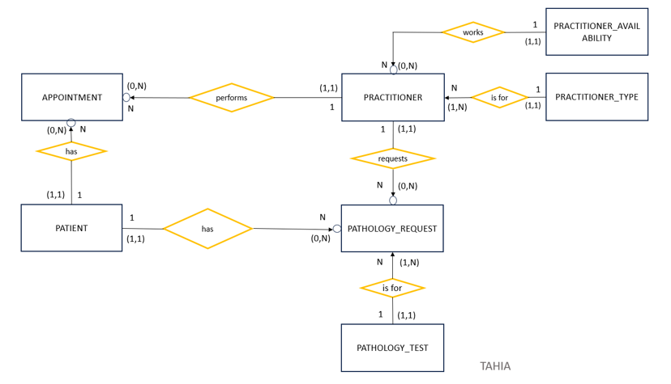

# 🏥 Medical Practice Database System (MySQL 8.3)

## 📌 Project Overview

This project is a fully designed and implemented relational database system for a medical practice, utilizing MySQL 8.3 (Command Line Client).

The system manages:

- Patients
- Practitioners (Doctors & Nurses)
- Practitioner Types
- Weekly Availability
- Appointments (15-minute intervals)
- Pathology Tests and Requests

The database was designed from business requirements and normalized to Third Normal Form (3NF) to ensure data integrity and eliminate redundancy.

## 🛠 Technologies Used

- MySQL 8.3 (CLI)
- SQL (DDL, DML, DQL)
- Views
- Stored Procedures
- CSV Import using 'LOAD DATA INFILE'
- Relational Data Modeling (3NF)

---

## 🗂 Database Structure

Main tables created:

- Patient
- Practitioner
- PractitionerType
- Weekdays
- PractitionerAvailability
- Appointment
- PathologyTest
- PathologyRequest

Key design features:

- Primary and Foreign Key constraints
- Unique constraints (Medicare number, AHPRA registration number)
- Prevention of double-booked appointments
- Referential integrity enforced

---

## 📊 Key SQL Queries Implemented

The project includes analytical and business-driven queries such as:

- Total working days and total hours per practitioner
- Appointments for a specific doctor on a specific date
- Patients without appointments born before 1950
- Patients with at least three appointments (sorted descending)
- Days since last appointment
- Fifth-oldest patient
- Newsletter mailing list per household (deduplicated)
- Custom date and time formatting queries

These demonstrate advanced SQL skills, including:

- JOIN operations
- GROUP BY & HAVING
- Aggregate functions
- Subqueries
- Date calculations
- Sorting & formatting
- String concatenation

---

## 👁 Views Created

- `vwNurseDays` – Retrieves nurse name, phone details, and working days
- `vwNSWPatients` – Retrieves all patient details for patients residing in NSW

---

## ⚙ Stored Procedures Implemented

- `spSelect_vwNSWPatients` – Retrieves NSW patients ordered by postcode
- `spInsert_vwNSWPatients` – Inserts a new NSW patient using parameters
- `spModify_PractitionerMobilePhone` – Updates practitioner mobile number using Practitioner ID

---

## 📥 Data Import

Data was imported from CSV files using:

LOAD DATA INFILE

The system was implemented using MySQL 8.3 Command Line Client.

---

## 📐 ERD (Entity Relationship Diagram)

---

## 🚀 How to Run

1. Create the database:

2. Run table creation scripts.

3. Load CSV data using 'LOAD DATA INFILE'.

4. Execute queries, views, and stored procedures.

---

## 🎯 Skills Demonstrated

- Database design from business requirements
- Data normalization (1NF → 3NF)
- Constraint management
- CSV data import
- Advanced SQL querying
- View creation
- Stored procedure development
- Business rule enforcement

